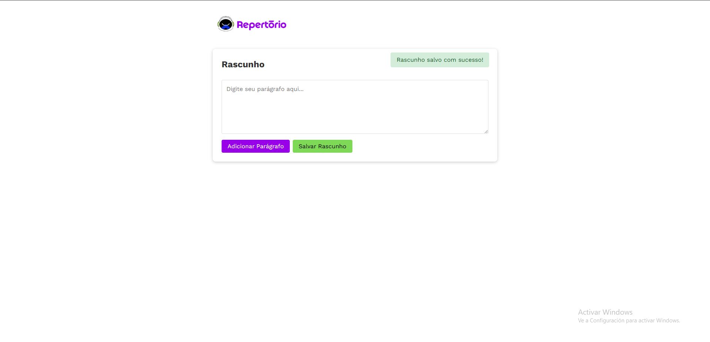

# Repertório

Este é um projeto para o teste de desenvolvedor fullstack da empresa repertório.
Hospedagem: https://repertorio-gamma.vercel.app/



## Tecnologias Utilizadas

- React
- Vite
- Typescript
- CSS

## Pré-requisitos

Antes de começar, certifique-se de ter instalado em sua máquina:

- [Node.js](https://nodejs.org/) (versão 16 ou superior recomendada)
- [npm](https://www.npmjs.com/) ou [yarn](https://yarnpkg.com/)

## Como Rodar o Projeto

1. Clone este repositório:
   ```sh
   git clone https://github.com/Bruno-Ferr/repertorio.git
   ```

2. Acesse a pasta do projeto:
   ```sh
   cd repertorio
   ```

3. Instale as dependências:
   ```sh
   npm install
   # ou
   yarn install
   ```

4. Inicie o servidor de desenvolvimento:
   ```sh
   npm run dev
   # ou
   yarn dev
   ```

O projeto estará disponível em `http://localhost:5173/` (caso utilize Vite).

## Estrutura do Projeto

```
repertorio/
│-- src/
│   ├── components/      # Componentes reutilizáveis
│   ├── pages/           
│   ├── assets/          # Imagens e arquivos estáticos
│   ├── App.tsx
│   ├── main.tsx
│-- public/
│-- package.json
│-- vite.config.js 
│-- README.md
```

Branch com Features Extras

Além da branch principal, existe uma branch more-features que contém algumas funcionalidades extras como:

- [X] Edição de parágrafos
- [X] Minimizar/Maximizar input de texto
- [ ] Marca texto

Para acessá-la, use:

```
git checkout more-features
```
